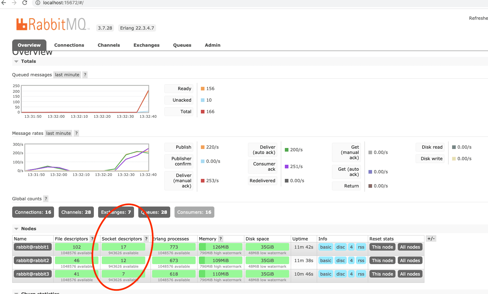
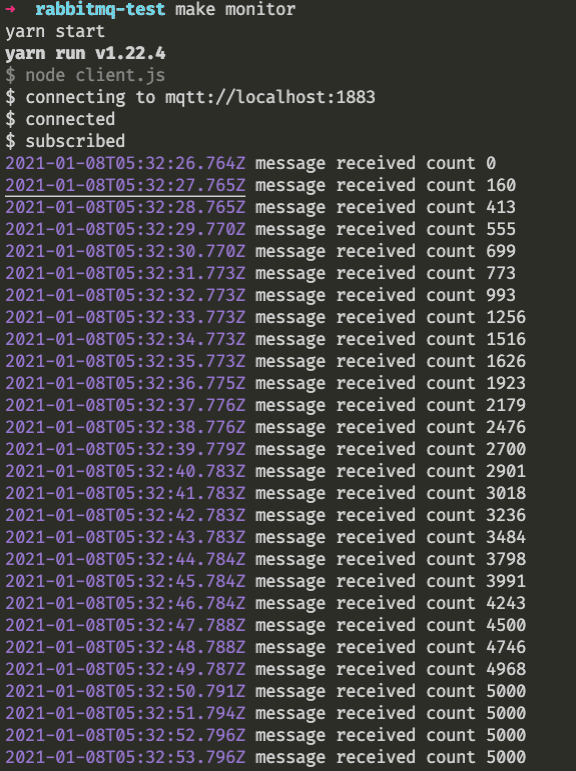

# rabbitmq mqtt broker cluster testing

## requirements

1. `haproxy` v2.2.0

2. `docker` v20.10.0, build 7287ab3

3. `node` v12

4. `npm` or `yarn`

## up and run

1. `make build`

2. `make start`

3. `make haproxy`

## test if cluster working

1. `make monitor`

2. `make stress`

should be able to see all nodes are working during `yarn stress`

received `5,000` messages in align with `mqtt-stresser-darwin-amd64 -broker tcp://localhost:1883 -num-clients 50 -num-messages 100 -rampup-delay 1s -rampup-size 10 -global-timeout 30s -timeout 20s` in `yarn stress`

i found after increaded `-num-clients 50 -num-messages 100` to higher like `-num-clients 1000 -num-messages 2000` will get bad result on my i7 Macbook.

## references

https://github.com/docker-library/rabbitmq/issues/273#issuecomment-412207393

https://stackoverflow.com/a/39052040/6414615

https://github.com/inovex/mqtt-stresser
